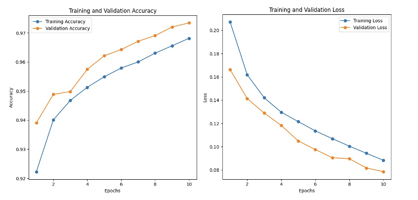
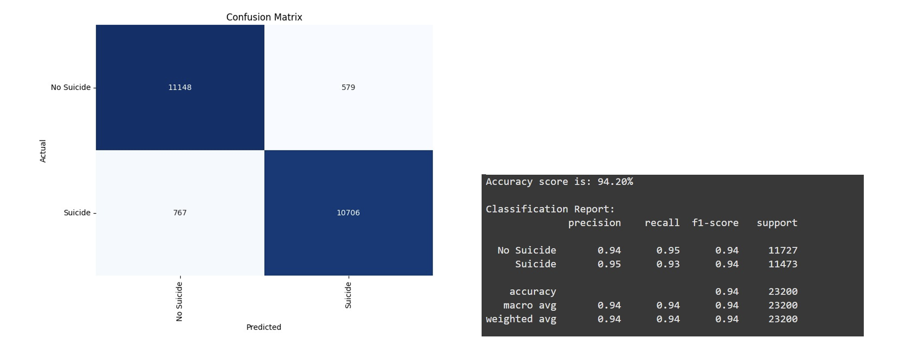
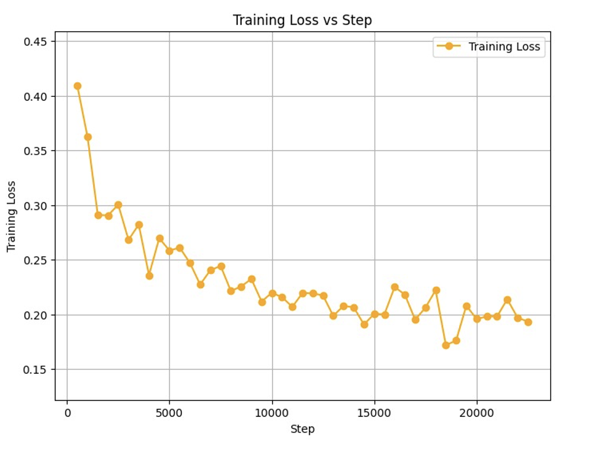
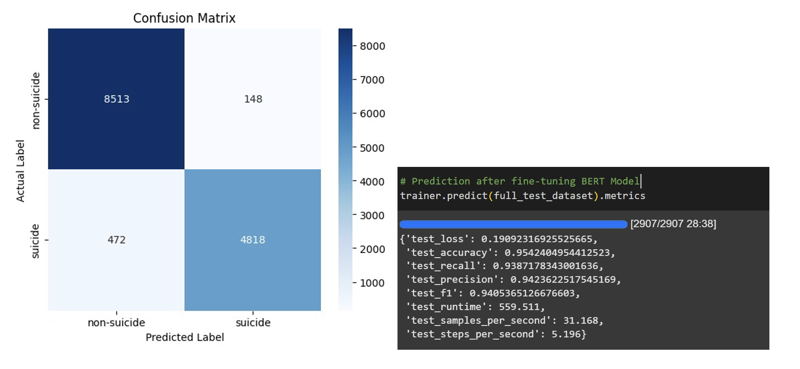
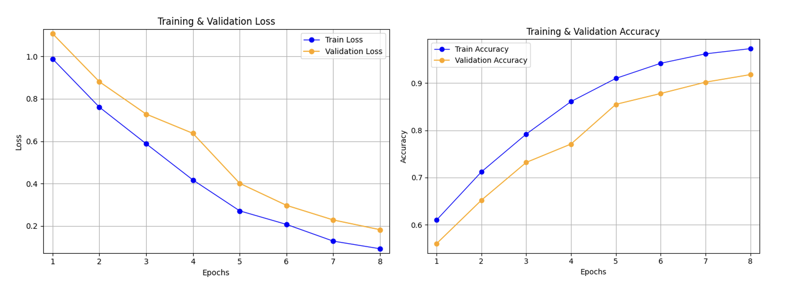
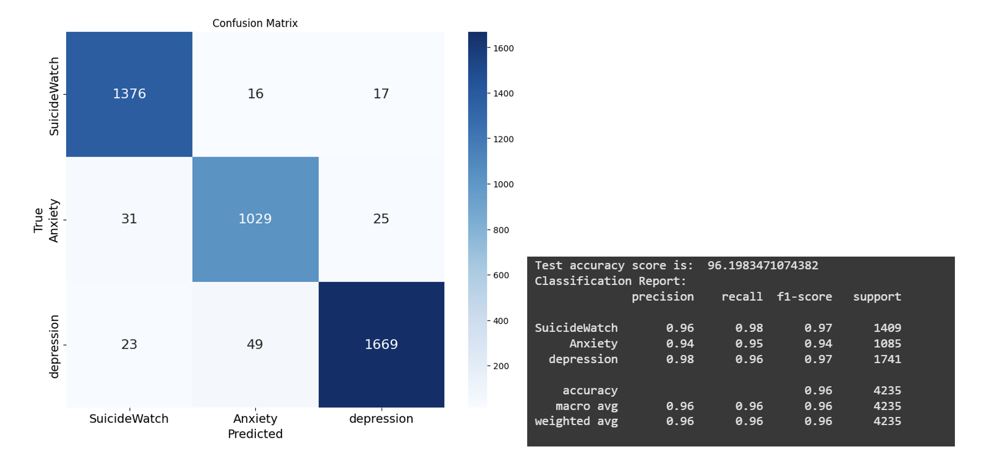
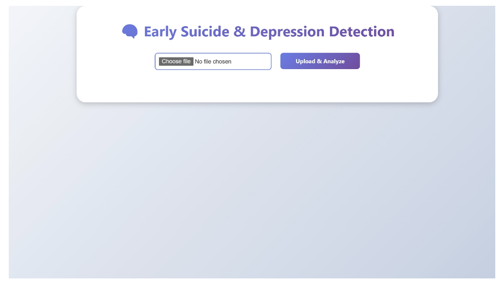
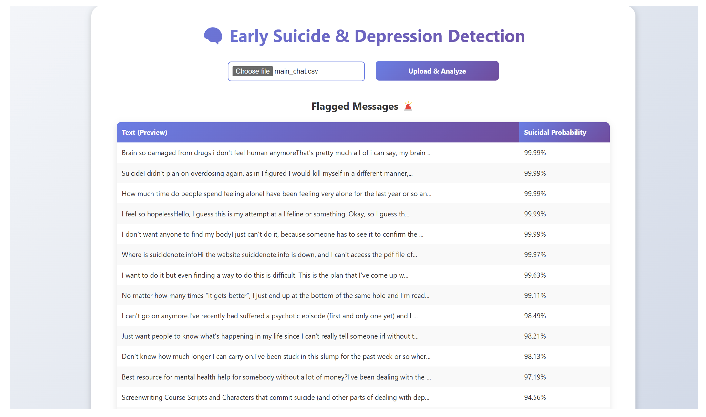
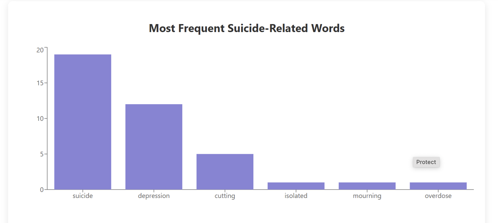
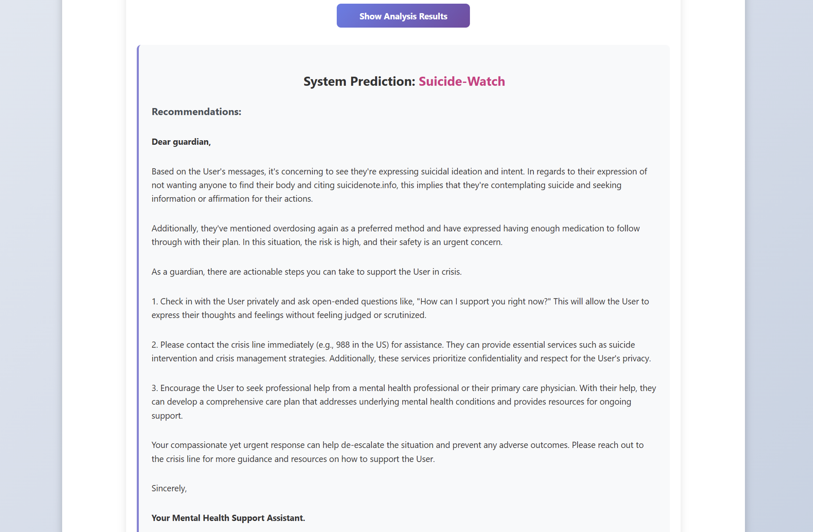

# 🧠 Depression and Suicide Risk Detection using Machine Learning

This project leverages advanced machine learning and natural language processing techniques to enable **early detection of depression and suicidal ideation**, primarily through analysis of textual data from digital sources.

## 🚀 Motivation

Mental health disorders, particularly depression and suicidal tendencies, are escalating global issues. Traditional diagnosis methods—relying on self-reporting and clinical evaluation—often fail to identify early warning signs. This project was motivated by the need for **automated, real-time systems** that can flag mental health concerns at an early stage, offering a chance for timely intervention and support.

## 🛠️ Technologies and Approach

- **NLP & Deep Learning Models**: Bi-LSTM, CNN, SVM, and Transformer-based models like BERT were used to classify mental health indicators in text.
- **Dataset**: Social media posts and forums provided linguistic data to train classifiers on patterns associated with depression and suicidal ideation.
- **Hybrid Model**: Combines CNN and RNN architectures to enhance classification accuracy by capturing both local and sequential features in text.

## 📊 Results & Evaluation

This section presents a summary of the model evaluation, demonstrating the system’s effectiveness in detecting suicidal ideation, anxiety, and depression using deep learning models.

---

### 🎯 Objective

The goal was to assess the performance of the proposed machine learning system in identifying individuals at mental health risk through text classification. The models were evaluated based on accuracy, precision, recall, and F1-score. In addition, the system's usability—especially through the web interface and interpretative message generation—was analyzed to determine its practicality for real-world applications.

---

### 📈 BiLSTM Model Performance

The BiLSTM model was trained over 10 epochs for binary classification (Suicide vs No Suicide):

- The model showed consistently increasing training and validation accuracy with decreasing loss.
- The confusion matrix indicates excellent performance with high true positives and true negatives, and well-balanced false predictions.

> 

> 

---

### 🤖 BERT Model (Binary Classification)

The BERT model was fine-tuned for binary classification:

- Training loss steadily decreased across training steps, indicating successful learning.
- Achieved a test accuracy of **95.4%**, with minimal false positives and false negatives.

> 

> 

---

### 🔄 BERT Multi-class Classification

The model was extended to classify text into **three classes**: SuicideWatch, Anxiety, and Depression:

- Both training and validation accuracy improved over epochs.
- The confusion matrix showed high accuracy in all three classes with minimal misclassification.

> 

> 

---

### 📋 Performance Metrics Summary

#### 🧪 Binary Classification (Suicide Detection)

| Model   | Accuracy | Recall  | Precision | F1 Score |
|---------|----------|---------|-----------|----------|
| BiLSTM  | 0.9420   | 0.9331  | 0.9487    | 0.9409   |
| BERT    | 0.9542   | 0.9387  | 0.9423    | 0.9405   |

#### 🔢 Multi-class Classification (SWMH)

| Model | Accuracy | Recall  | Precision | F1 Score |
|-------|----------|---------|-----------|----------|
| BERT  | 0.9620   | 0.9620  | 0.9621    | 0.9620   |

---

### 🧩 Insights

- Both models demonstrated high generalization ability with minimal overfitting.
- BERT outperformed BiLSTM in all binary classification metrics.
- The multi-class BERT model achieved exceptional performance, showcasing its ability to distinguish between related mental health conditions with high reliability.
- Combined with the frontend dashboard, these models form an effective tool for early mental health risk detection and intervention.

## ✅ Accuracy

- **BERT (Binary Classification)**: Achieved **96.4% accuracy** in detecting suicidal messages.
- **BERT (Multi-Class Classification)**: Achieved **91.2% accuracy** for classifying between healthy, depressive, and suicidal messages.
- **Support Message Generation**: The system also suggests empathetic, supportive responses based on detected emotional tone.

## 🖥️ Frontend / User Interface

The project features a robust, user-friendly interface designed to assist both technical and non-technical users—particularly guardians, parents, and mental health professionals—in monitoring and responding to at-risk behavior.

### 🔍 Chrome Extension

- A lightweight **Chrome Extension** passively monitors users' web search queries for potentially harmful or self-harm-related terms.
- These queries are securely forwarded to the backend for real-time evaluation using trained machine learning models.
- This component allows non-intrusive observation, ensuring privacy while enabling early risk detection.

---

### 🧠 Web Dashboard for Analysis

The **Dashboard** empowers users to analyze chat or message data (in CSV format) and receive actionable insights.

#### 📂 File Upload & Analysis

- Users can upload chat history files through the "Choose File" and "Upload & Analyze" options.
- The backend processes each message using a BERT-based classifier to determine potential mental health risks.

> 

---

#### 🚩 Flagged Messages with Suicidal Probability

- After analysis, the dashboard highlights high-risk messages.
- Each flagged message is shown with a **Suicidal Probability Score** (in %) calculated by the BERT model.
- Messages are sorted in descending order of severity for immediate attention.

> 

---

#### 📊 Suicidal Word Frequency Chart

- A bar chart visualizes the frequency of key terms associated with suicide and depression.
- Helps guardians identify dangerous language patterns in the uploaded text data.

> 

---

#### 🤖 System Prediction & AI Recommendations

- Displays an **overall risk level** for the user based on all messages.
- AI-generated recommendations guide guardians on how to respond.
  - Highlights specific concerns (e.g., intent, plans).
  - Suggests direct communication, crisis line contact, or professional help.

> 

---

### ✅ Key Benefits

- **Early Risk Identification**: Enables timely action before potential crises emerge.
- **Contextual Explanations**: Offers transparency by showing which phrases contributed to the prediction.
- **Actionable Guidance**: Provides concrete steps for intervention, making it easier for non-experts to respond effectively.
- **Data-Driven Decisions**: Helps guardians move beyond assumptions and make informed choices backed by AI analysis.

This integrated frontend ensures **real-time, accessible, and proactive mental health monitoring**, significantly improving the ability to intervene early and support those in need.

## 🌟 Advantages

- **Early Intervention**: Proactively detects signs of mental distress from everyday digital interactions.
- **Non-intrusive Monitoring**: Uses text analysis to assess risk without violating privacy through invasive means.
- **Extensible Architecture**: Easily adaptable for various mental health conditions beyond depression and suicide.
- **Human-in-the-loop Design**: Allows professionals or parents to review predictions before taking action.
